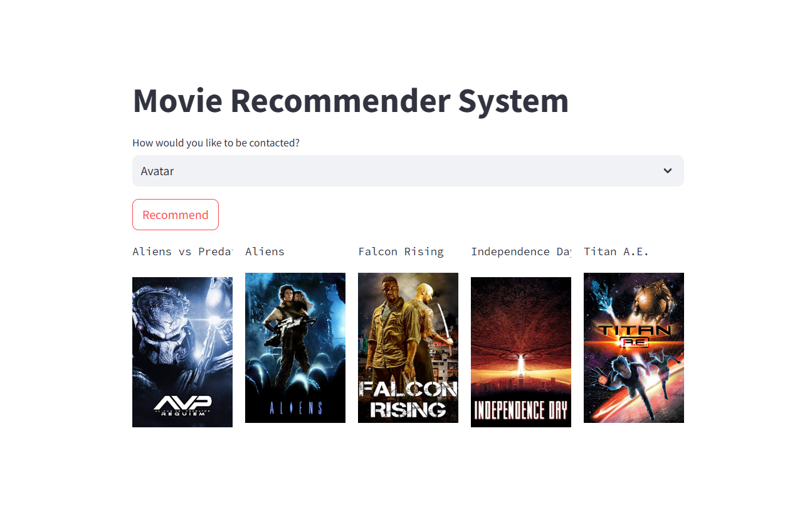
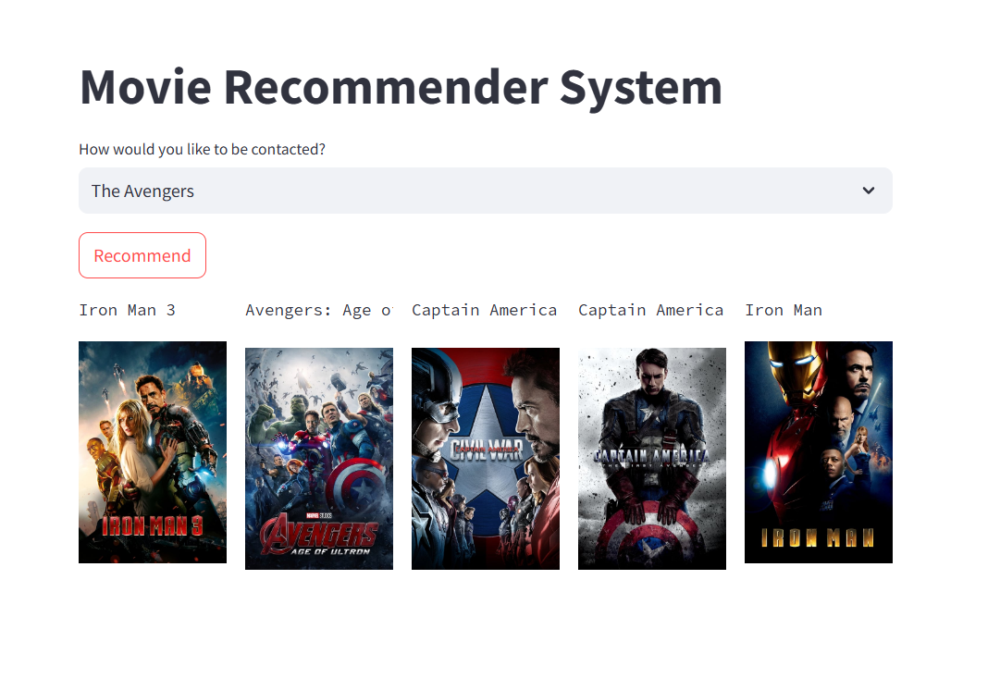
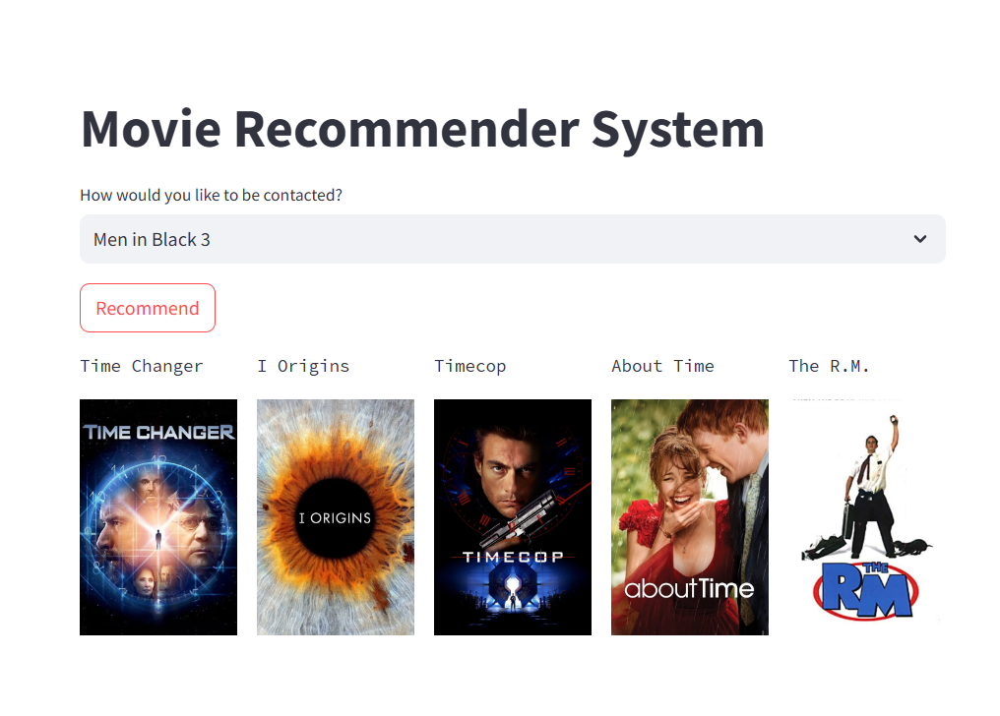

This project involves developing a movie recommendation system using Python and Streamlit. 
The goal is to create an interactive web application that helps users discover new movies based on their preferences.
The system leverages collaborative filtering and content-based filtering techniques to provide personalized movie recommendations.

