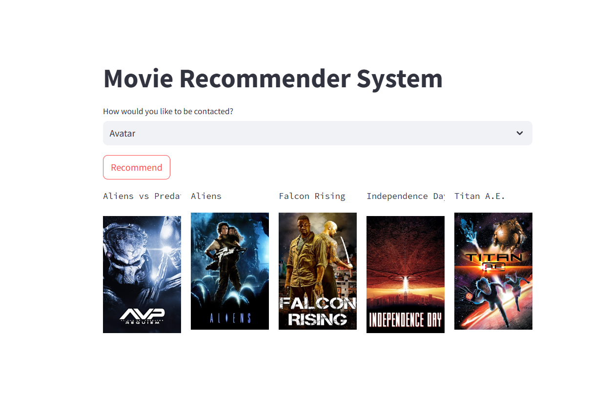
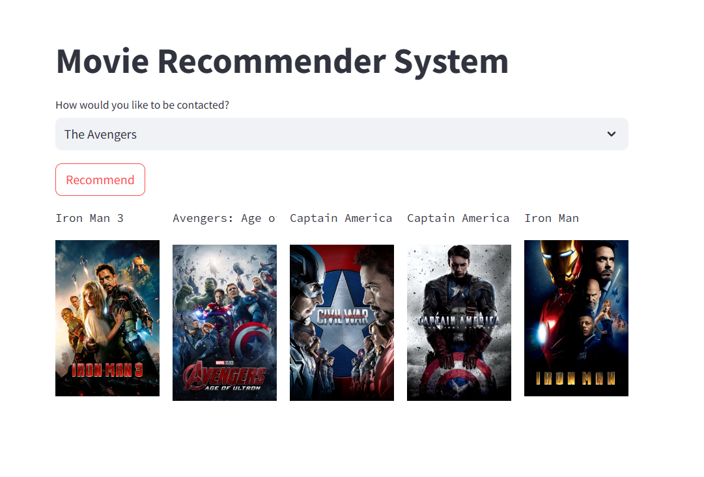
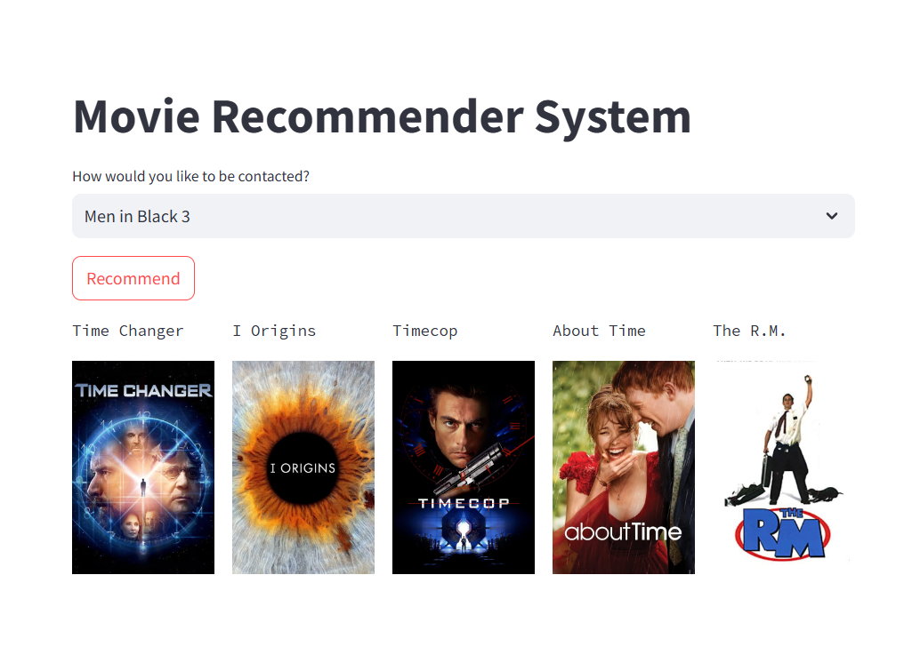

<h1 style="font-weight:bold">MOVIE RECOMMENDER SYSTEM</h1>

## Movie Recommender System
Overview
The Movie Recommender System is an interactive web application developed using Python and Streamlit. This project aims to assist users in discovering new movies tailored to their preferences through personalized recommendations.

## Features
Collaborative Filtering: Utilizes user behavior and preferences to suggest movies.
Content-Based Filtering: Recommends movies based on the attributes of the movies themselves.
User -Friendly Interface: Built with Streamlit for an engaging user experience.

## Installation
To set up the project locally, follow these steps:

1. **Clone the repository:**
   ```bash
   git clone https://github.com/Deepanshu8560/Movie-Recommender-System.git
2. **Navigate to the project directory:**
   ```bash
   cd Movie-Recommender-System
3. **Install the required packages:**
   ```bash
   pip install -r requirements.txt
## Usage
1. **Run the application:**
   ```bash
   streamlit run app.py
   
2. **Access the application:**
   Open your web browser and go to http://localhost:8501.

## 📁 Files Included

- **Movie_Recommendation.ipynb :** Jupyter Notebook containing the recommendation logic and experimentation.

- **app.py :** Main application file for the Streamlit-based web interface.

- **movie_dict.pkl :** Serialized dictionary containing movie metadata for generating recommendations.

- **movies.pkl :** Additional preprocessed movie data used for display and mapping.

- **Requirements.txt :** List of Python dependencies required to run the application.

- **tmdb_5000_movies.csv :** Dataset from TMDB containing detailed movie information (titles, genres, overview, etc.).

---







## Contributing
 - Contributions are welcome! If you have suggestions for improvements or new features, please fork the repository and submit a pull request.
